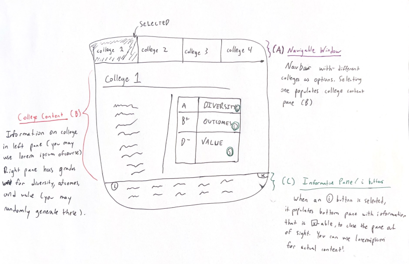

# Take home interview
## The Setup
Navigate [here]() to find the repository.

Fork it into your personal github, and see what we'd like you to implement below. Note that we don't wish this to take more than 2 hours of work at maximum - so please do use a component library like material or bootstrap or whichever you choose, so you don't have to code these individual components from scratch.

## The Task
We'd like you to implement the mock-up below:



More information is given on the three sections below. While you work, remember: what we're looking for is your ability to (1) retrieve and render information from an API, (2) craft visual elements that have a cohesive design and intuitive layout, and (3) the small touches that make a website's appearance go from complete to professional. How you get there is up to you! (And really, don't forget to use a component libary otherwise this'd take way too long).

Your code will be written within `./pages/CollegeView.tsx`:
```
./src/
├── components/
├── pages/
│   └── CollegeView.tsx
└── App.tsx
```

### Sections A, B, and C: What we want you to implement
#### A: College NavBar
A navbar with different colleges as options. Use real college names by extracting the 'instnm' field from the list of colleges returned from [https://real-ranker-backend.com/data](https://real-ranker-backend.com/data)
#### B: College Information Pane
An informational pane for a college, with text on the left and grades in different categories on the right. You may use lorem ipsum for the filler and can have static or randomly generated grades, its the way you present information and how it looks together that counts for this pane in particular.
#### C: i button pop-outs
For each category that a college has, place an i button that:
- on-hover: has a sentence explanation on-hover
- on-click: has a modal pop-out with a paragraph explanation

The explanations themselves won't be evaluated, so you can use lorem ipsum no problem. 

## To run a local instance:
`npm start`